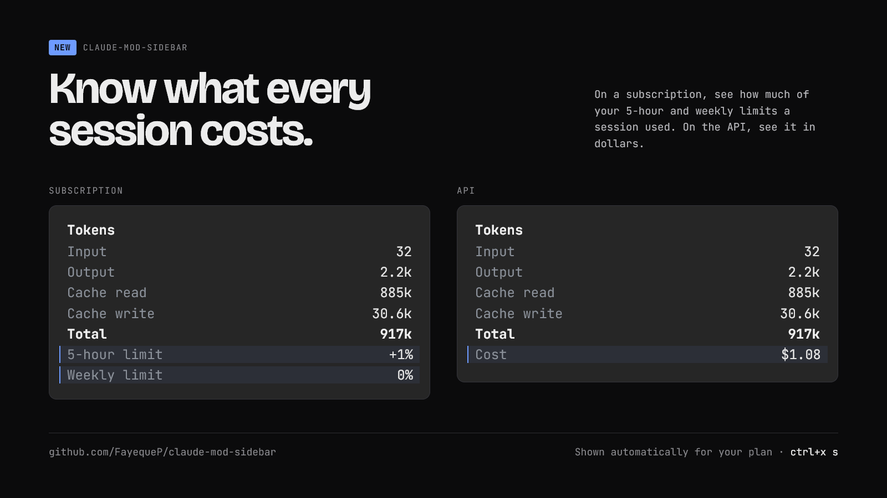
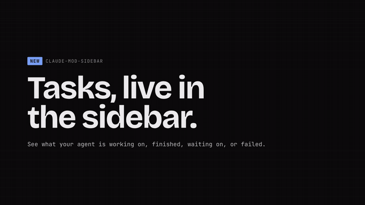

<p align="center"></p>

# sidebar

**A live stats sidebar for Claude Code:** context use, token counts, prompt-cache
hit rate and expiry, the model's real output speed, and your git state, docked
beside the conversation.

<p align="center">
  
  
</p>

## Updates

### Know what every session costs · v0.1.20

On a subscription, see how much of your 5-hour and weekly limits a session
used. On an API key, see it in dollars. The sidebar picks the right one for
your plan automatically.

<p align="center"></p>

### Tasks · v0.1.19

Follow the agent's plan as it works: every task with a progress bar, a spinner
and timer on the one running, ✓ when done and ✗ when it fails.

<p align="center"></p>
<p align="center"><sub><a href="docs/update-tasks.mp4">Watch in full quality</a></sub></p>

## Install

```sh
claude plugin marketplace add FayequeP/claude-mod-sidebar
claude plugin install sidebar@claude-mod-sidebar
```

It needs Claude Code 2.1.269+ with function hooks turned on in
`~/.claude/settings.json`:

```json
{ "env": { "CLAUDE_CODE_ENABLE_FUNCTION_HOOKS": "1" } }
```

To dock it as a sidebar in the terminal, use the fullscreen renderer
(`/tui fullscreen`). On the classic screen it shows as a compact strip above
the prompt.

## What it shows

| Section | What you get |
|---|---|
| **Tasks** | The agent's to-do list: a progress bar and every task, marked ✓ done, a spinner and timer while in progress, ○ not started, or ✗ failed (Claude marks a failed task done with a title like `FAILED: …`). Hidden when there's no list |
| **Context** | How full the context window is, as a bar and `85.4k / 272k` |
| **Tokens** | This session's input (uncached), output, cache read, cache write and total, subagents included, then what this session spent: on a subscription, how much of your **5-hour** and **weekly** limits it used (e.g. `+9%`); on an API key, its **cost** in dollars, as `/cost` reports it |
| **Cache** | Hit rate (share of all input served from the cache), and a countdown to when the main conversation's prompt cache expires |
| **Speed** | Time to first token and output speed in tokens per second |
| **Workspace** | Folder, git branch, clean or changed, lines added and removed |

**About Tasks:** Claude Code turns its task tools off by default for newer
models such as Opus 5.5, and without them Claude writes its plan as plain text
the sidebar can't follow. The sidebar switches them back on for its own sessions
(`CLAUDE_CODE_ENABLE_TODO_TOOLS=1`). If you'd rather keep them off, set
`"CLAUDE_CODE_ENABLE_TODO_TOOLS": "0"` in the `env` block of
`~/.claude/settings.json`; the sidebar leaves your choice alone and Tasks stays
hidden.

## Show and hide

- Type `/sidebar`, or press the **Hide sidebar** button at its foot.
- For a keyboard shortcut (terminal), add this to `~/.claude/keybindings.json`
  and press `ctrl+x s`:

  ```json
  { "bindings": [ { "context": "Global", "bindings": { "ctrl+x s": "app:toggleReplTab" } } ] }
  ```

  Plugins can't own a key yet, so the sidebar's toggle button borrows that
  engine action and the chord presses it.

## Resize

- **Desktop app:** drag the sidebar's edge.
- **Terminal:** click the sidebar to focus it, then press `ctrl+x ←` to widen it
  or `ctrl+x →` to narrow it. These are Claude Code's own pane keys
  (`pane:grow` / `pane:shrink`), so you can rebind them in
  `~/.claude/keybindings.json`.

Claude Code remembers the width you choose; it takes priority over the sidebar's
default of 38 columns.

## How the numbers are measured

<details>
<summary><b>Output speed</b></summary>

Output tokens divided by the time from the first streamed piece of the response
to the last one, for the main conversation only (a subagent may run another
model). Text, thinking and tool-call arguments all count. Token counts
come from the API's `usage.output_tokens`; while a response is still
streaming, a live estimate of about 4 characters per token is shown instead.

Responses that arrive in under half a second are skipped, because one network
burst would read as thousands of tokens per second. The previous reading stays
on screen.

</details>

<details>
<summary><b>Cache expiry</b></summary>

The prompt cache lives for a fixed time after each request. Send your next
message before **Expires in** reaches zero and the conversation is read from
cache, which is cheaper and faster. After that, the whole context is written
to cache again.

The sidebar works out the time to live the way Claude Code does for the main
conversation. The first rule that matches wins, and its source is shown under
the countdown bar, for example `1h cache · subscription`:

| Shown as | Rule | Lasts |
|---|---|---|
| `env` | `CLAUDE_CODE_PROMPT_CACHE_TTL` set to `5m` or `1h` | as set |
| `env` | `FORCE_PROMPT_CACHING_5M=1` | 5 min |
| `env` | `ENABLE_PROMPT_CACHING_1H=1` | 1 hour |
| `setting` | `"promptCacheTtl": "5m"` or `"1h"` in settings.json | as set |
| `subscription` | Claude subscription within its usage limits | **1 hour** |
| `over limit` | Subscription with a usage window at 100% | 5 min |
| `API key` | API key, Bedrock, Vertex or Foundry | 5 min |

These defaults come from Claude Code's own description of `promptCacheTtl`
(v2.1.287). A subscription is recognised by Claude Code reporting usage-limit
windows, which happens after the first reply of a session. Subagents and
background helpers use 5 minutes by default on every plan; the countdown
follows the main conversation only.

</details>

## License

[MIT](LICENSE). Contributions welcome, see [CONTRIBUTING.md](CONTRIBUTING.md).
